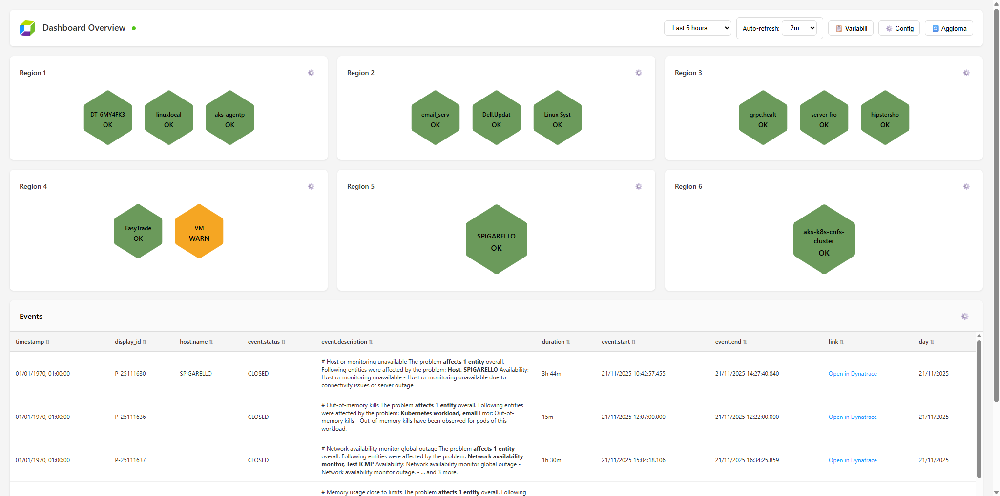

# Dynatrace Simple External Dashboard

A lightweight, customizable dashboard for visualizing Dynatrace data through DQL queries. Features a fixed layout with 6 hexagonal tiles and 1 data table.



The dashboard can run locally or on a public webserver using either a Python or PHP proxy. All settings are stored in the browser's localStorage and can be exported/imported.

## Files

| File | Description |
|------|-------------|
| `dashboard.html` | Main dashboard application |
| `proxy_server.py` | Python proxy for local use |
| `proxy.php` | PHP proxy for webserver deployment |

## Quick Start

### Option A: Local Setup (Python Proxy)

**Requirements:** Python 3

1. Place `dashboard.html` and `proxy_server.py` in the same folder
2. Start the proxy server:
   ```bash
   python3 proxy_server.py
   ```
3. Open `http://localhost:8081` in your browser
4. Click **Config** and enter:
   - **Proxy Mode:** Python Proxy
   - **Tenant URL:** `https://xxx.apps.dynatrace.com`
   - **API Token:** Your Dynatrace token
5. Click **Save**

### Option B: Webserver Setup (PHP Proxy)

**Requirements:** PHP-enabled webserver

1. Configure `proxy.php` by editing the API key:
   ```php
   define('PROXY_API_KEY', 'YOUR_SECRET_KEY');
   ```

2. Upload files to your webserver:
   ```
   /public_html/
     ├── dashboard.html
     └── proxy.php
   ```

3. Open `https://your-domain.com/dashboard.html` in your browser

4. Click **Config** and enter:
   - **Proxy Mode:** PHP Proxy
   - **PHP Proxy URL:** `https://your-domain.com/proxy.php`
   - **Proxy API Key:** Same key configured in proxy.php
   - **Tenant URL:** `https://xxx.apps.dynatrace.com`
   - **API Token:** Your Dynatrace token

5. Click **Save**

## Dashboard Configuration

### Hexagonal Tiles

Click the settings icon on any tile to configure its query and field mappings. Queries must return: name, status (OK/WARN/ALERT), and optionally a link.

### Events Table

Click the settings icon on the table to customize its DQL query.

### Global Variables

Define reusable variables via the **Variables** button. Reference them in queries using the `${{VARIABLE_NAME}}` syntax.

### Export/Import

Use **Config > Export** to save all settings as JSON, and **Config > Import** to restore them.

## Dynatrace Token

This dashboard requires a Platform Token. See the [Dynatrace documentation](https://docs.dynatrace.com/docs/shortlink/platform-tokens) for details.

Assign scopes based on your query requirements:

- `storage:buckets:read`
- `storage:events:read`
- `storage:metrics:read`
- `storage:logs:read`
- `storage:entities:read`

## Troubleshooting

| Issue | Solution |
|-------|----------|
| Red status indicator | Verify the proxy is running |
| 401 Error | Check API Token or Proxy API Key |
| 403 Error | Verify Dynatrace token permissions |
| CORS Error | Ensure you're using a proxy, not direct connection |
| Empty data | Validate your DQL query in the Dynatrace console |

## Notes

- Auto-refresh interval is configurable from 30 seconds to 60 minutes
- PHP proxy includes rate limiting (30 requests/minute per IP)
- All settings persist in browser localStorage

## License

MIT License - See [LICENSE](LICENSE) for details.
